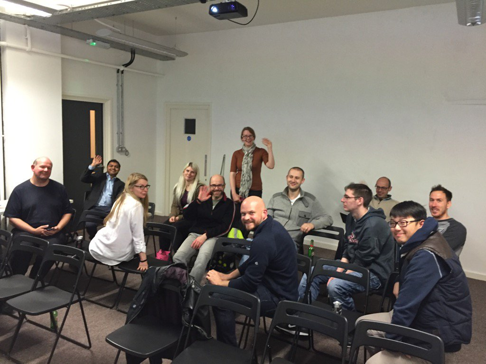

<!-- http://rmarkdown.rstudio.com/rmarkdown_websites.html -->

Welcome to the home of R North East an R user group based in Newcastle. 

Here you'll find information about upcoming talks and [events](events.html). Our group usually meets up once every two months. 

You can find us on Twitter [\@RstatsNE](https://twitter.com/RstatsNE)

IMPORTANT ANNOUNCEMENT:

The R North East group has now merged with the [Data Science Meetup Group](https://www.meetup.com/Newcastle-Upon-Tyne-Data-Science-Meetup/). You'll still be able to see the schedule for all the relevant R talks here but the official meetup event will be on the Data Science meetup page. We shall also be removing the mailing list so if you wish to contact us please do so through the Data Science meetup. 

  

  

